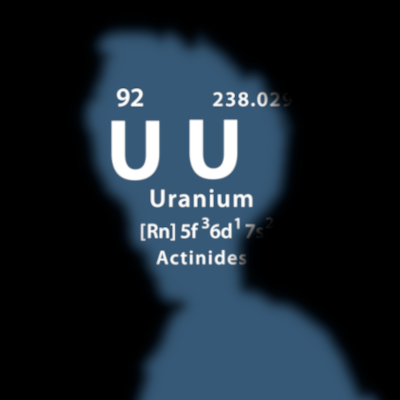
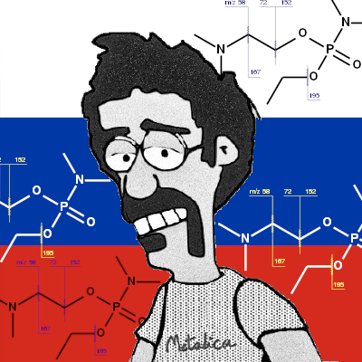
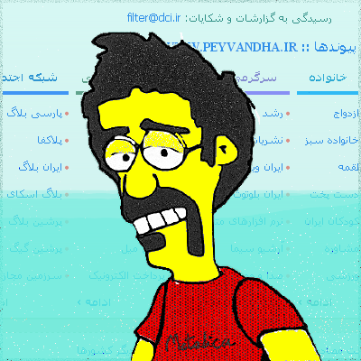

[github](https://github.com/iamvee/avatars) | [website](http://iamv.ir/avatars)

# my-twitter-avatars

|         |     |      |     |    |
| -------:|-----|------|-----|----|
|         |    |      |      |     |
|   date: |  June 30th, 2022   |  June 27th, 2022    | June 27th, 2022         |  December 26th 2021   |
|   nfts: |  [ShanbehZadeh](https://opensea.io/assets/matic/0x2953399124f0cbb46d2cbacd8a89cf0599974963/106729941008393675044050043075032805306029214061193222995262175167701260959745) | [vee avatar: internet censorship and filtering content](https://opensea.io/assets/matic/0x2953399124f0cbb46d2cbacd8a89cf0599974963/106729941008393675044050043075032805306029214061193222995262175166601749331969) | [vee avatar: hot summer day (June 27, 2022)]() |[Handmaid's Tale](https://opensea.io/assets/matic/0x2953399124f0cbb46d2cbacd8a89cf0599974963/106729941008393675044050043075032805306029214061193222995262175100631051665409) |
|    ref: | [[1]](https://twitter.com/hosseyn1988/status/1542394688887455745)    |      |     |    |

|         |     |      |     |    |
| -------:|-----|------|-----|----|
|         |  |  |   |    |
|   date: |     |     |      |     |
|   nfts: |  [...]()  |  [...]()  |  [...]()  |  [...]()  |
|    ref: |     |      | [[1]](https://www.hamshahrionline.ir/news/595827/%D9%88%D8%A7%DA%A9%D8%B3%DB%8C%D9%86%D8%A7%D8%B3%DB%8C%D9%88%D9%86-%D8%AF%D8%B1-%D8%A7%DB%8C%D8%B1%D8%A7%D9%86-%D9%BE%D9%88%D9%84%DB%8C-%D9%85%DB%8C-%D8%B4%D9%88%D8%AF)    |  [[1]](https://twitter.com/OfficialMNamjoo/status/1383126886155485193) [[2]](https://www.bbc.com/persian/iran-56787193)  |

|         |     |      |     |    |
| -------:|-----|------|-----|----|
|         |       |   |      |  | 
|   date: |     |      |     |    |
|   nfts: |     |      |     |    |
|    ref: |     |      |  [[1]](https://twitter.com/mhnajmi64/status/1382315879560527872)   |    |

|         |     |      |     |    |
| -------:|-----|------|-----|----|
|         |  |  |    |    |
|   date: |     |      |     |    |
|   nfts: |     |      |     |    |
|    ref: |     |      |     |    |

|         |     |      |     |    |
| -------:|-----|------|-----|----|
|         |    |  |  |  | 
|   date: |     |      |     |    |
|   nfts: |     |      |     |    |
|    ref: |     |      |     |    |

|         |     |      |     |    |
| -------:|-----|------|-----|----|
|         |  |  |  در حراج تهران: تابلوی آغداشلو ۲۷/۱۰/۹۹") |  | 
|   date: |     |      |     |    |
|   nfts: |     |      |     |    |
|    ref: |     |      |     |    |

|         |     |      |     |    |
| -------:|-----|------|-----|----|
|         |   |  |  |   | 
|   date: |     |      |     |    |
|   nfts: |     |      |     |    |
|    ref: |     |      |     |    |

|         |     |      |     |    |
| -------:|-----|------|-----|----|
|         |  |  |   |  | 
|   date: |     |      |     |    |
|   nfts: |     |      |     |    |
|    ref: |     |      |     |    |

|         |     |      |     |    |
| -------:|-----|------|-----|----|
|         |  |   |  |  |
|   date: |     |      |     |    |
|   nfts: |     |      |     |    |
|    ref: |     |      |     |    |

